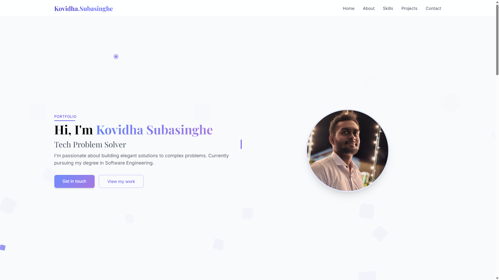
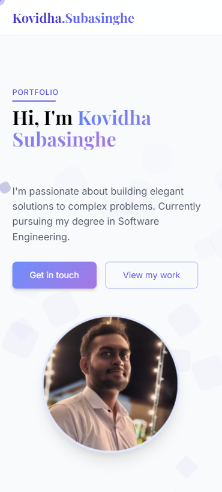

# Kovidha Subasinghe | Portfolio

Welcome to the official GitHub repository for my personal portfolio website!  
This portfolio showcases my projects, resume (CV), and professional details — all in one place.

🔗 **Live Site**: [kovidha-subasinghe.vercel.app](https://kovidha-subasinghe.vercel.app)

---

## 📌 About

This website is built as a single-page application using modern HTML, CSS (Tailwind), and JavaScript. It features:

- A responsive layout optimized for desktop and mobile.
- Smooth navigation with project details.
- Integration with Basin for form submissions.
- SEO-optimized meta tags and structured data.
- Google Search Console integration for visibility.

---

## 🧠 Features

- **Projects Section**: Displays selected projects with detailed pages.
- **Resume/CV**: Downloadable.
- **Contact Form**: Powered by Basin (no backend required).
- **SEO Ready**: Includes meta tags and JSON-LD schema.
- **Mobile Friendly**: Fully responsive and tested on real devices.

---

## 🛠️ Tech Stack

- HTML5
- Tailwind CSS
- Vanilla JavaScript (ES6)
- JSON-LD (Schema.org)
- Vercel (for hosting)

---

## 🚀 Getting Started (Optional for Local Development)

```bash
# Clone the repo
git clone https://github.com/your-username/portfolio.git

# Navigate to the folder
cd portfolio

# Open index.html in your browser
```

## 🖼️ Screenshots

| Desktop View | Mobile View |
| ------------ | ----------- |
|  |  |

---

## 🙋‍♂️ About Me

I’m **Kovidha Subasinghe** — a web developer, tech enthusiast, and creator of cool things.  
I enjoy building clean, functional web experiences using modern tech stacks.

When I’m not coding, I’m probably doing something else interesting — check my projects and you’ll see.

---

## 📫 Contact

Want to work together or have a question?  
Reach me anytime:

- 📧 Email: **kovidhasubasinghe@gmail.com**
- 🌐 Portfolio: [kovidha-subasinghe.vercel.app](https://kovidha-subasinghe.vercel.app)
- 💻 GitHub: [@roguechocoholic](https://github.com/roguechocoholic)

---

## 📄 License

This project is open-source under the MIT License — free to use, modify, and share.  
Attribution is appreciated but not required.

---
